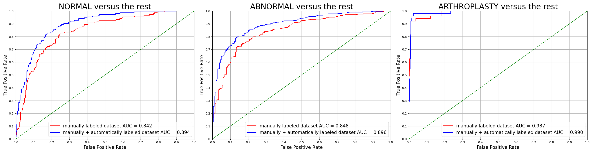

# knee_clf

Code repository for "Improving Image Classification of Knee Radiographs: An Automated Image Labeling Approach"

Developed by [Jikai Zhang](https://github.com/JikaiZ/MADLaP).

Shield: [![CC BY-NC-SA 4.0][cc-by-nc-sa-shield]][cc-by-nc-sa]

This work is licensed under a
[Creative Commons Attribution-NonCommercial-ShareAlike 4.0 International License][cc-by-nc-sa].

[![CC BY-NC-SA 4.0][cc-by-nc-sa-image]][cc-by-nc-sa]

[cc-by-nc-sa]: http://creativecommons.org/licenses/by-nc-sa/4.0/
[cc-by-nc-sa-image]: https://licensebuttons.net/l/by-nc-sa/4.0/88x31.png
[cc-by-nc-sa-shield]: https://img.shields.io/badge/License-CC%20BY--NC--SA%204.0-lightgrey.svg

## Usage

Specify the execution command in `run_main_nlp.sh` and `run_main_img.sh` and execute the shell scripts in terminal.

## Results

## Disclaimer

The information, including but not limited to, text, graphics, and other materials contained in this repository is not intended to be a subsitute for professional medical advice, diagnosis or treatment. 
